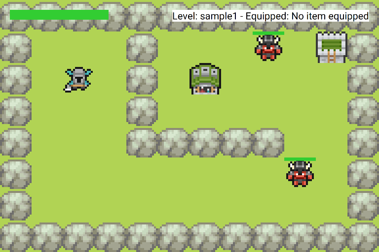

  <h1>CSE 116 Game Engine</h1>

# Introduction

This project will be the main component of the coding tasks for CSE 116. For each task, all the information you need is
on [cse116.com](https://cse116.com/). Scroll through the course schedule to find links to the requirements for each
task. Links will go live as they are released.

If you ever have any questions, visit [piazza](https://piazza.com/class/meahudzh24h333/) to ask questions and find the
office hours schedule.

This readme aims to provide a broad overview of the project scope and structure, and to be a useful reference while
working on the tasks. That said, each file in the project will have comments and documentation that explain their
purpose in more detail, and the task handouts always have the specifics of the assignments.

You are free (and encouraged!) to explore the repository and make changes to the project outside of the homework we
assign. Being able to read, understand, and edit code that is not all your own is a vital skill in your software
development journey. If you have any questions about how something works or why we did it that way, we would be happy to
explain it!

> [!warning] While you are encouraged to make changes and have fun with the project, you should be careful with the
> changes you make.
>
> A good rule of thumb is to
>
> -   Never move files/folders around in the filetree.
> -   Never change method/class names or access modifiers.
>
> Making any of these changes gives a very high chance that you will fail during autograding since the grader is
> expecting a specific structure.
>
> If you _really_ want to, create a new branch on git, or just copy + paste the files into a separate directory and make
> your changes there.

There are many modifications you can make that are guaranteed to be safe, however. For example:

-   Changing sprites/backgrounds/sound effects.
-   Changing options in `Configuration`.
-   Creating new files/classes/methods\*.
-   Completing the tasks.

\*Creating new files/classes/methods is usually fine, as long as they are not used from within your test classes. This
is because during autograding, your tests are run against our code, which would not have these files/classes/methods.

With that being said, here is some information to give you a better understanding of the repository and project, whether
you're playing around for fun, or working on your coding tasks.

---

# Project Overview

Throughout this semester, you will be programming a game engine along with building out the functionality of several
games that will utilize this engine. All tasks will build on this project and add more features to the engine and games.

> Most of the information described in this section will not be relevant until after Task 0 is completed. However, feel
> free to read ahead even if you have not completed that task.

After cloning the repo, you should run `StartGame` to launch the engine. However, it will not be able to start until
Task 0 is mostly complete. When it is, a new window should open showing a 2D pixel-art top-down view game which looks
something like this.

As you can see, it's basically a marvel of modern graphics. You probably thought this was photograph of cosplayers at a
medieval festival, but it's actually in game graphics from this project.

When you run the game, you'll notice that you can't actually do anything. That's because major components of the game
engine are missing. Your job is to complete it. Some of the beginning tasks include adding functionality such as player
movement, collision detection, level loading, and physics. Later tasks include enemy AI and pathfinding.

While this sample game showcases the basics of the engine, there are several other games on offer that you will complete
throughout the project. To change which game you are playing, find the file `Configuration` and change the variable
_GAME_ to another game. The games currently available are "Sample Game", "Minesweeper", "Snake", "Mario", "Pacman", and
"Roguelike Game. None of these are likely to be playable at the beginning of the project, and more may be available by
the end of the semester.

## The Coordinate System

The coordinate system used for computer graphics might be different than you used to. We'll use the standard coordinate
system that is typically used in video games (and anything involving rendering to a screen).

The origin of the system is at the top-left of the screen/window/level with positive x going right and positive y going
down. This image shows the same information as the one above, but with the coordinate system labeling all the tiles in
the game. You can see that "G" (The goal) is at location (6, 2).

Each object within the game has several important properties to consider, namely a location and a hitbox, which has its
own location and dimensions. These quantities are each represented as 2-dimensional vectors (x, y). All objects and
hitboxes are rectangles, and their location is the location of their upper left corner. Their dimensions are the width
and height of the rectangle. For example, the goal (G on the grid above) has a location of (6, 2), since that's the
location of its upper-left corner, and it has dimensions (1, 1) since it's exactly 1 tile in size. Locations and
dimensions do not have to be whole numbers.

Object locations and dimensions also do not necessarily have to be aligned with the visuals of that object. In the image
above, the green dot represents the location of that object, the blue outline represents the size of the sprite image
that is being rendered for that object, and the red outline represents the size of its hitbox. Having a hitbox smaller
than the graphical sprite allows for more precise physics and collision, but means that extra care has to be taken when
dealing with those properties. Pressing F4 in game shows overlays of each object's hitbox, which can be helpful for
debugging.

## Project Structure

At first glance, the size of this project can be quite intimidating. However, there's a logical, hierarchical
organization to it that can help to make sense of it. While there are many other components besides the ones described
here, many of them you will never need to touch or understand, and are simply to make the games look or play well.

The top level class is the application itself, in this case `StartGame`. When you run this class, it creates a `Game`,
of whatever type you're playing. Each game will have one or more levels, often in a linear sequence, as well as a
player. Each `Level` possesses a list of static objects and a list of dynamic objects, as well as a set of controls for
keyboard and mouse input and a physics engine. Each `DynamicGameObject` (which includes the player) has a location, a
hitbox, and health. `StaticGameObject`s also have a location and hitbox, but do not have health.

While specific logic differs for each game, the responsibilities of each type of class remain consistent: **Games**
manage **Levels**; **Levels** manage overall logic, and possess **Controls**, **PhysicsEngines**, and **Objects**;
**Controls** handle keyboard and mouse input, and forward behavior to the **Level** when necessary; **PhysicsEngines**
handle logic for collisions and movement; **Objects** handle only their own behavior, and how they interact with other
**Objects**.

For example:  
Minesweeper begins with a `MinesweeperGame`. All this class is responsible for is managing UI and visual elements, and
creating levels. The `MinesweeperLevel` class is where the bulk of program logic sits, and this class is responsible for
actions like uncovering tiles. Whenever you click with the mouse, the `MinesweeperControls` class takes this action and
gives it to the current level for further action. All of the **Objects** in Minesweeper, like `CoverTile`s,
`NumberTile`s, and `Bomb`s, simply look pretty, since there is no interaction between objects in this game.

Although it's somewhat complex, understanding this hierarchy can make navigating the project and completing the tasks
much simpler. You should try to familiarize yourself with this structure in the early tasks.

## IntelliJ Tips

IntelliJ is a powerful IDE (Integrated Development Environment) with many tools that can make programming easier. In no
particular order, some of our favorite tips and uses are listed below.

-   Shift-shift to search: Double tapping the shift key brings up a menu that allows you to search for files, functions,
    and other parts of the project. This can be very useful for navigating the codebase quickly, even once you're
    familiar with the layout.
-   Debugger: The debuggger is an invaluable tool for understanding exactly what your code is doing, especially if it's
    doing something wrong. There will be several lectures and labs about using it, but it may help to familiarize
    yourself with it early.
-   Auto format: When writing code, it's easy for it to get messy, with misaligned brackets and indents. The shortcut
    Ctrl+Alt+L (⌘+⌥+L on macOS) will automatically format the current file, fixing these issues.
-   Javadoc comment viewing: Hovering your mouse over the name of a class or method shows details, called javadoc
    comments, which describe the purpose and function of the method in greater detail. Most of the provided classes and
    methods in the game engine have these comments, and nearly all Java built-in classes and methods have them.
-   Inspection tooltips: Hovering over a red or yellow underlined portion of code shows a description of the issue, as
    well as, often, a suggested fix. Be careful automatically applying the fix, though, as it may have unintended
    effects.
-   Comment/uncomment region: Use the shortcut ctrl+/ (⌘+/ on macOS)to comment out all of the lines you have selected.
    If these lines are already commented, they will be uncommented instead.
-   Go to declaration: By holding the control key (⌘ on macOS), clicking on the name of a class or method takes you to
    the declaration of that method. This can help when exploring a large codebase.

## Level Editor

Some games, like the sample game and Mario, are well suited to the creation of custom levels. To that end, we have
created a [Level Editor](https://jbcarras.github.io/) that you can use to create or edit levels within the game, before
exporting to a csv that can be read by the level parser that you will create in an early task.

This level editor should be capable of placing and displaying most of the common objects within the sample game and
Mario, and allows for creation of custom objects and level types. It should make custom level creation much easier than
manual csv editing.

# Repository layout

Each file (or the majority of them) contain comments and documentation that explain the purpose of that file and the
methods within it. If you're curious about the function of a package or file within the game engine, that is the best
place to start. However, this should provide a high-level overview of the project structure as a whole, in relative
order of importance.

## `src/main/java`

This is the source root for the project. All package names are relative to this directory.

## `src/main/java/app`

This folder (also called a package) contains all the code for the project. It contains four files and several packages
of its own.

**StartGame**: Run this file to run the game engine. You should run this while or after completing the first task to
ensure that it is working properly and that everything is set up correctly with your IntelliJ install.

**Configuration**: This file contains several constants used for running the games. The String _GAME_ selects which game
will run when you run StartGame. The project is set up to be able to create multiple games that use the same game
engine.

**Zipper**: Unrelated to the game engine itself, this class provides a utility to compress the project to a zip file
that can be submitted to the autograder. While you are permitted to use other means to compress the project, know that
there is a limit to the size of files that can be submitted, and this is the best way to ensure that you are within that
limit, as it only compresses files necessary for grading.

**Settings**: This file contains several settings that may change while the game is running. Most of these are
controllable with keyboard input.

## `src/main/java/app/tests/`

This package is where you will be writing all of your tests for each task.

## `src/main/java/app/games/`

Inside this package, you will find all the code for handling the game state. If you want to change a level, change a
sprite for an object, or change the entire game itself, this is where you would do so.

## `src/main/java/app/gameengine/`

This package has everything that the games need in order to run. Each sub-package is listed in detail below.

### `src/main/java/app/gameengine/model/`

This package contains all the meta stuff of the actual game: Game objects, physics, AI (this will be implemented in a
later task), data structures, etc.

This is where you will write much of your code throughout the coding tasks.

### `src/main/java/app/gameengine/statistics/`

This package contains classes related to recording game statistics and tracking the scoreboard. You will implement much
of this functionality in a later task.

### `src/main/java/app/gameengine/utils/`

This package contains several utility classes (utils) with static methods that can be useful. Some of these you will be
told to use, and others are there simply for convenience if you wish to use them.

## `src/main/java/app/display/`

This package mostly deals with input and output from the application itself. This includes displaying graphics, handling
keyboard and mouse input, and playing music and sound effects. You will likely never be required to modify classes
within this package, but some of the sub-packages are explained below for the curious.

### `src/main/java/app/display/common/`

The files in this package, including sub-packages like effects and ui, control all the graphics rendered on screen:
stuff like managing the sprites, loading files, displaying UI elements, etc.

This package will not be tested in Autolab and you should never need to touch anything in this package when adding to
your game, unless you want to.

### `src/main/java/app/display/common/controller/`

This is where the controls for the game are. If you ever want to add a new button or remap your controls, this is where
you should do it.

This package will not be tested in Autolab so you have the freedom to change your buttons without affecting grading.

### `src/main/java/app/display/common/sound/`

This controls sound effects and music within the game. Like with graphics, this will not be tested in Autolab, and
should not need to be modified, but may be useful to understand if you wish to play your own sound effects or music.

## `data/`

This directory contains files necessary to running the games that are not source code. Namely sprites, background
images, and sound effects, though each is described in more detail below.

### `data/sprites/`

All sprites for displaying game objects are within this directory. Each directory contains a License.txt, some of which
are real licenses and others just describe where we got the files from. If you want to use more/different sprites in
your game, download or create more sprite sheets and add them to this directory.

### `data/backgrounds/`

For games that use background images, they are stored here. Most of these are just artistic landscape backgrounds not
associated with a specific game. A cool feature is that these have multiple layers that can be overlapped with different
parallax values to make farther objects appear to move slower than nearer ones.

### `data/fonts/`

Custom fonts should go here. You will likely never need to add or change these, unless you also modify UI elements.

### `data/icons/`

These are the icons used for the game while it is running. Each game can have it's own icon, which should be stored in
here.

### `data/levels/`

This folder contains csv files that describe the initial layout of levels for various games. You can create/modify
levels with the level editor, and one of your tasks will be to write a function that turns these files into playable
levels.

### `data/resources/`

These are resources not actually used by the game in any capacity, but are otherwise useful. For example, some of them
detail game mechanics that we attempted to replicate in the engine. The _readme_ subdirectory contains the images used
in this file.

### `data/stats/`

These are where the scores/statistics are saved so that high scores can be stored between instances of playing the game.
